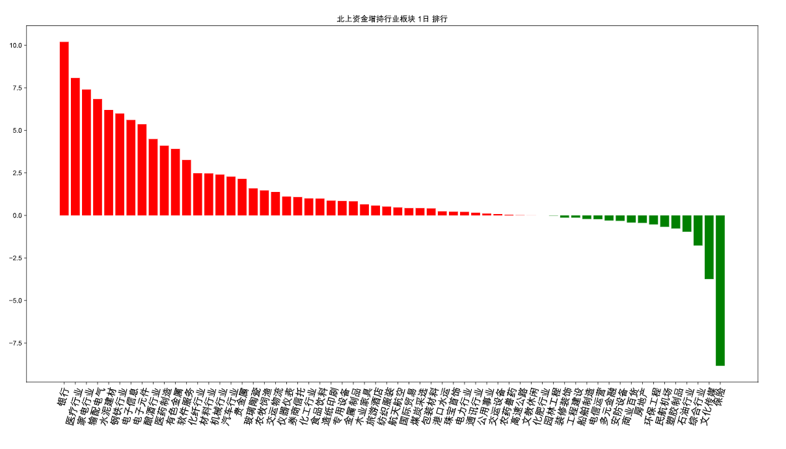
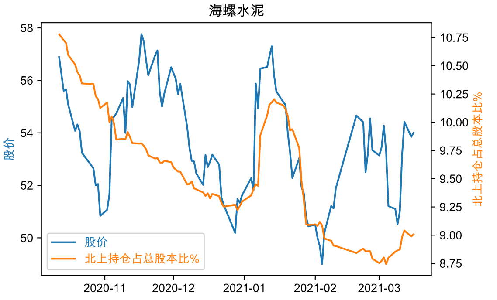

# NorthSniper

获取北上资金情况，可生成图表及保存数据至Excel文件。

**north_sniper.ipynb** 获取北上资金近1日、3日、5日、10日、月、季、年指标增减持各行业数据。生成资金流入流出柱状图，并保存全部指标数据至Excel表格中。如图：

**north_daily.ipynb** 查询个股近百日北上资金流入流出数据，并生成与股价走势对比的折线图。如下：

**north_daily_ten.ipynb** 获取当日沪深两市10大成交股。
